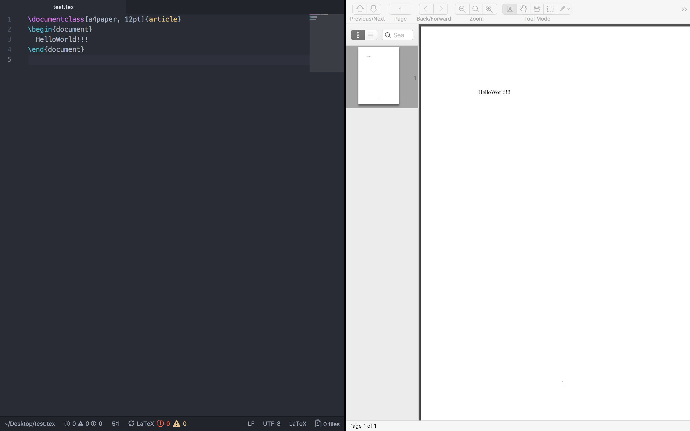

## MacTeX + Skim + Atom

這篇筆記將介紹如何在 [Atom](https://atom.io) 上透過 [LaTeX](https://atom.io/packages/latex) 插件編譯 `.tex` 文件並使用 [Skim](http://skim-app.sourceforge.net/) 檢視。

### Note

#### MacTeX

Install [MacTeX](http://skim-app.sourceforge.net/) via [Homebrew](https://brew.sh/):

```
$ brew cask install mactex
```

#### Atom LaTeX Package

Install [LaTeX](https://atom.io/packages/latex) package on Atom:

```
$ apm install latex
```

To compile `.tex` files, press `ctrl + alt + b`.

### Screenshot

After installed these tools, now you can view your `.tex` files on [Skim](http://skim-app.sourceforge.net/):



### Contributor

* [@jack456054](https://github.com/jack456054)
