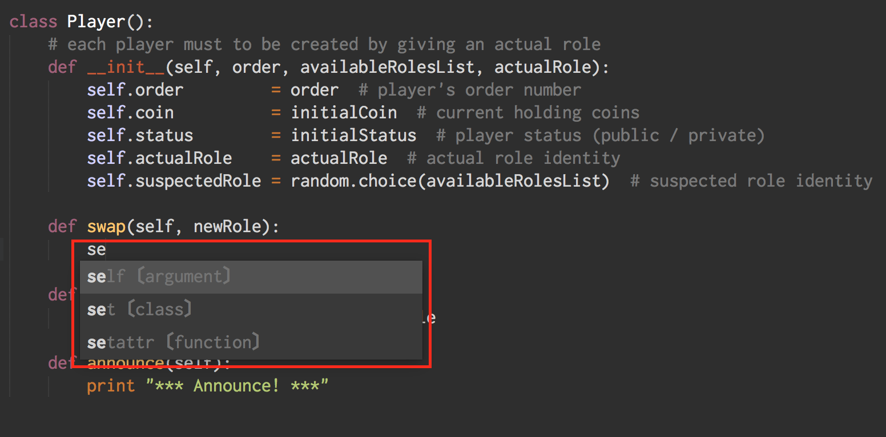
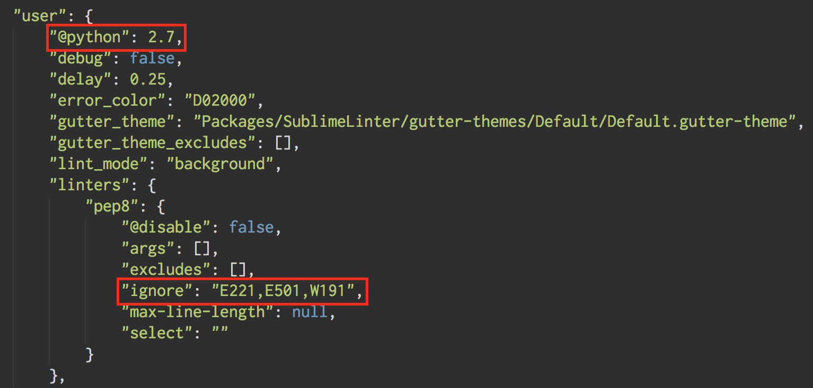

## Python in Sublime Text 3

在編寫程式碼的工具選擇上，許多人常使用 [Sublime Text 3](https://www.sublimetext.com/3) 作為首選的文字編輯器，而 Sublime Text 也的確提供了相當舒適的編碼環境。然而，由於 Sublime Text 3 本質上終究不是一個 IDE，許多 IDE 內建強大的輔助功能在 Sublime Text 3 上必須自己另外安裝。
這篇筆記主要以在 Sublime Text 3 下開發 Python 的環境為主。在這篇筆記中，我紀錄了如何在 Sublime Text 3 上安裝 [SublimeLinter-pep8](https://github.com/SublimeLinter/SublimeLinter-pep8) 與 [SublimeCodeIntel](https://github.com/SublimeCodeIntel/SublimeCodeIntel) 作為開發 Python 的輔助插件。

SublimeLinter 一直以來都是 Package Control 中排名中居於第一位的程式碼語法檢查器。SublimeLinter 除了可以即時幫多種語言即時偵錯，也可以有效提醒使用者一些好的編碼習慣。而 SublimeCodeIntel 則提供了相當完善的語法提示。在開發程式的過程中，SublimeCodeIntel 會在使用者輸入關鍵字時給予適當提示以減少編碼時錯誤發生的機率。這篇筆記會使用 [Package Control](https://packagecontrol.io/installation) 來進行插件安裝，若尚未安裝 Package Control 請先點擊連結安裝。

### Note

Open Terminal (or [iTerm2](https://www.iterm2.com/)), type the `$ sudo pip install flake8` and enter your admin password (In order to check Python syntax, we need to install [flake8](https://pypi.python.org/pypi/flake8), which is a modular source code checker on Mac).

When the process finishes, install [SublimeLinter-pep8](https://packagecontrol.io/packages/SublimeLinter-pep8) and [SublimeCodeIntel](https://packagecontrol.io/packages/SublimeCodeIntel) via the Package Control by pressing `Command + Shift + P` in the Sublime Text 3. Finally, restart your Sublime Text 3 and you are all set!

### Screenshot

**SublimeLinter-pep8**

**SublimeCodeIntel**

### [Optional]

You can customize the syntax checking rules by editing the `SublimeLinter.sublime-settings` file, which is located under `Sublime Text → Preferences → Package Settings → SublimeLinter → Settings – User`.
Add your ignore rules base on [Error and Warning Codes](http://pep8.readthedocs.org/en/latest/intro.html#error-codes). Please be aware that don't add space between comma and the rule number.

For example:

E221: whitespace before ‘(‘ 
E501: line too long (82> 79 characters) 
W191: indentation contains tabs 
