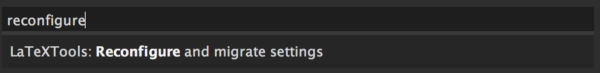
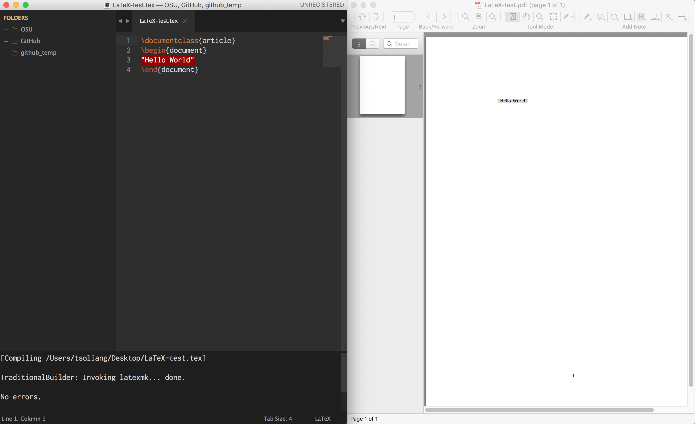

## MacTeX + Skim + Sublime Text 3

這篇筆記將介紹如何在 [Sublime Text 3](https://www.sublimetext.com/3) 上透過 [LaTeXTools](https://github.com/SublimeText/LaTeXTools) 插件編譯 `.tex` 文件並使用 [Skim](http://skim-app.sourceforge.net/) 檢視。開始之前必須請先將 [MacTex](https://tug.org/mactex/)、Skim 以及 [Package Control](https://packagecontrol.io/installation) 安裝完成再進行下列步驟。(本文參考自 [ LaTaX 簡易安裝教學](https://ike35.wordpress.com/2014/08/21/latex-setup/))

### Note

Install [LaTeXTools](https://github.com/SublimeText/LaTeXTools) via the Package Control by pressing `Command + Shift + P` in the Sublime Text 3. After finish the installation, restart the Sublime Text 3 and reconfigure the setting file by using Package Control again:

Now you can press `Command + B` to compile `.tex` file via Sublime Text 3 and viewing the result on Skim!

### Screenshot

