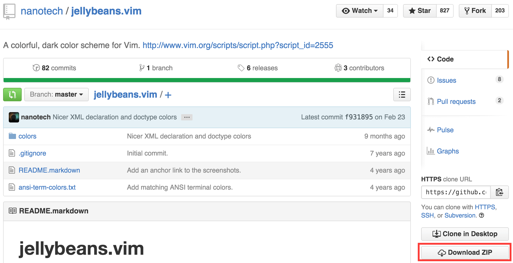
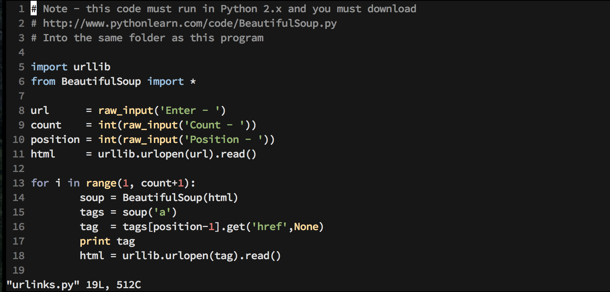

## Vim color scheme

雖然我大部分的時間是使用 [Sublime Text 3](https://www.sublimetext.com/3) 作為我的文字編譯工具，但在操作 terminal 終端機時仍然不可避免使用文字介面下的文書編輯器。在眾多文書編輯器中，我個人較常使用的是 [Vim](https://en.wikipedia.org/wiki/Vim_(text_editor)) 。這篇筆記將簡單介紹如何安裝 color scheme 在 Vim 中，並顯示文件行號。

### Note

In this note, I am going to use [jellybeans](https://github.com/nanotech/jellybeans.vim) as the example color scheme. You can download the color scheme you prefer and extract the archive file under *Downloads* folder.



If *~/.vim/colors* doesn't exist, type `$ mkdir -p ~/.vim/colors` to create the directory. After creating the directory, move the downloaded *.vim* file under colors directory to *~/.vim/colors* by typing `$ mv ~/Downloads/jellybeans.vim-master/colors/*.vim ~/.vim/colors`. Finally, open your *~/.vimrc* file via Vim by typing `$ vim ~/.vimrc`, and edit it as follow to enable your color scheme:

```
syntax on
colorscheme jellybeans
set nu
```

### Screenshot


