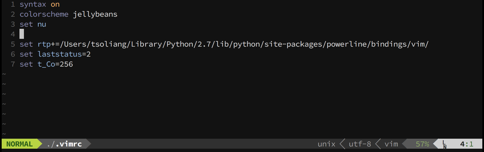

## Vim color scheme

雖然我大部分的時間是使用 [Sublime Text 3](https://www.sublimetext.com/3) 作為我的文字編譯工具，但在操作 terminal 終端機時仍然不可避免使用文字介面下的文書編輯器。在眾多文書編輯器中，我個人較常使用的是 [Vim](https://en.wikipedia.org/wiki/Vim_(text_editor))。這篇筆記將簡單介紹如何安裝 color scheme 在 Vim 中，並顯示文件行號。

### Note

In this note, I am going to use [jellybeans](https://github.com/nanotech/jellybeans.vim) as the example color scheme. You can download the color scheme you prefer and extract the archive file under `Downloads` folder.


Create `~/.vim/colors` directory if it doesn't exist:

```
$ mkdir -p ~/.vim/colors
```

Move the downloaded `.vim` file under colors directory to `~/.vim/colors`:

```
$ mv ~/Downloads/jellybeans.vim-master/colors/*.vim ~/.vim/colors
```

Finally, edit your `~/.vimrc` file as follow to enable your color scheme:

```shell
syntax on
colorscheme jellybeans
set nu
```

### Screenshot


### [Optional]

You may also enable [powerline](https://github.com/powerline/powerline) for your vim editor. To install powerline on you machine, please refer to my another article: [Zsh / Oh-My-Zsh + iTerm2 + Powerline](../shell/zsh/zsh-oh-my-zsh-iterm2-powerline.md). After setting up powerline on your machine, enable powerline on vim by editting `~/.vimrc`:

```shell
syntax on
colorscheme jellybeans
set nu

set rtp+=/Users/tsoliang/Library/Python/2.7/lib/python/site-packages/powerline/bindings/vim/
set laststatus=2
set t_Co=256
```

### Screenshot


