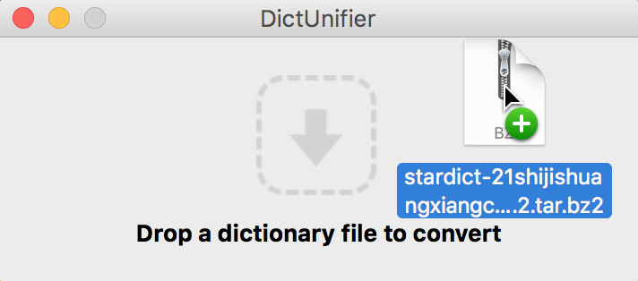
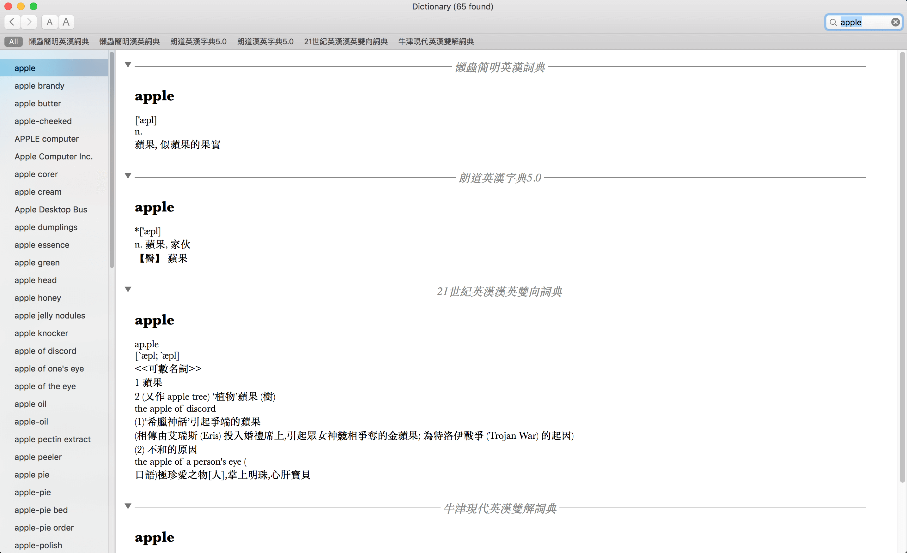

## DictUnifier + StarDict

這篇筆記簡單記錄了如何在 Mac 原生 Dictionary 上利用 [DictUnifier](https://github.com/jjgod/mac-dictionary-kit) 安裝 [StarDict](http://download.huzheng.org/) 中英字典檔。

### Note

Download [DictUnifier](https://github.com/jjgod/mac-dictionary-kit) and run the app. After the installation, drag a tarball dictionary file, which downloaded from StarDict, into DictUnifier.

Wait until the process finishes, then click the dictionaries you want to import under the `Preferences of Dictionary` and you are done!

**DictUnifier + StarDict**

### [Optional]

The dictionary files will be installed under `/Users/<username>/Library/Dictionaries`. However, the visibility attribution of `Library` is invisible by default. To view the files, you can type the following command to show invisible directories:

`$ defaults write com.apple.finder AppleShowAllFiles TRUE;\killall Finder`
