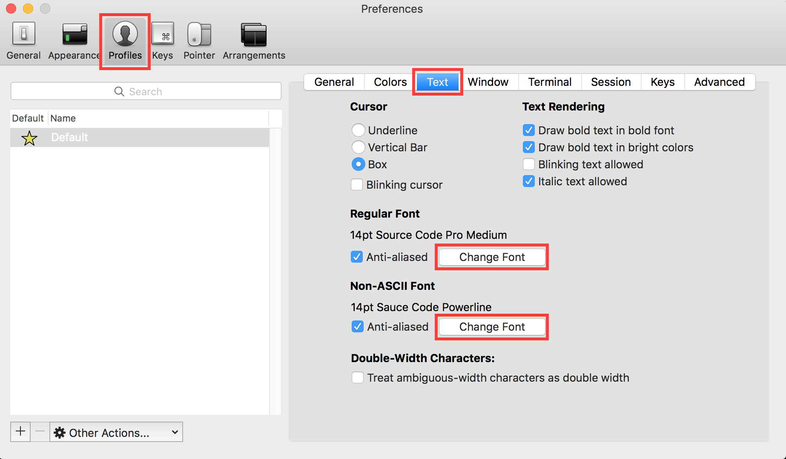
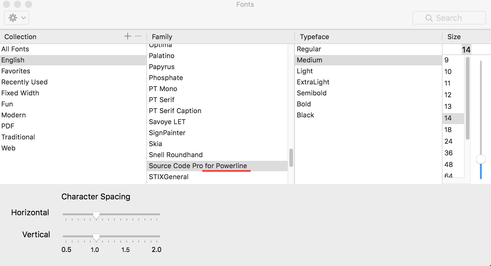
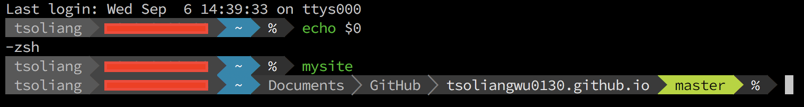

## Zsh / Oh-My-Zsh + iTerm2 + Powerline

在 [Fish Shell + iTerm2 + Powerline](../fish/fish-shell-iterm2-powerline.md) 一文中我曾介紹過如何使用 [Fish Shell](http://fishshell.com/) 與 [Powerline](https://github.com/powerline/powerline) 來取代 macOS 中內建的 Terminal 終端機與 [Bash shell](https://en.wikipedia.org/wiki/Bash_(Unix_shell))。雖然 Fish 預設的設定對一般使用者來說已經非常友善了，但隨著使用時間越來越長，我發現 Fish 對於 Bash 的相容性其實仍然相當不足。因此，在這篇筆記中，我將記錄如何使用 [Zsh](http://www.zsh.org/) 以及 [Oh-My-Zsh](http://ohmyz.sh/) 來取代 Bash ，並透過 [zsh-autosuggestions](https://github.com/zsh-users/zsh-autosuggestions) 與 [zsh-syntax-highlighting](https://github.com/zsh-users/zsh-syntax-highlighting) 這兩個 plugins 來保有 Fish 的強大自動補齊及語法提示功能。同樣的，這篇開發環境配置筆記仍然會使用到 [Xcode IDE](https://itunes.apple.com/tw/app/xcode/id497799835?mt=12) 的開發環境，並需要安裝 [Homebrew](http://brew.sh/index_zh-tw.html) 套件管理工具以及 [iTerm2](https://www.iterm2.com/) 終端機，若還沒安裝請點擊連結安裝。

### Note

Open [iTerm2](https://www.iterm2.com/), and run the following commands to install Zsh and Oh-My-Zsh:

```
$ brew install zsh
$ chsh -s /bin/zsh
$ git clone git://github.com/robbyrussell/oh-my-zsh.git ~/.oh-my-zsh
```

Copy Oh-My-Zsh's `zshrc.zshrc-template` as `.zshrc`. If you have your own `.zshrc` file, feel free to use your's:

```
$ cp ~/.oh-my-zsh/templates/zshrc.zsh-template ~/.zshrc
```

Install plugins via Homebrew:

```
$ brew install zsh-autosuggestions
$ brew install zsh-syntax-highlighting
```

Now install Powerline:

```
$ brew install python
$ pip install powerline-status --user
$ pip install powerline-shell
```

Define your zsh prompt by adding the following code to your `.zshrc` file:

```shell
function powerline_precmd() {
    PS1="$(powerline-shell --shell zsh $?)"
}

function install_powerline_precmd() {
  for s in "${precmd_functions[@]}"; do
    if [ "$s" = "powerline_precmd" ]; then
      return
    fi
  done
  precmd_functions+=(powerline_precmd)
}

if [ "$TERM" != "linux" ]; then
    install_powerline_precmd
fi
```

Install the [Powerline Fonts](https://github.com/powerline/fonts) by typing the commands below:

```
$ git clone https://github.com/powerline/fonts.git
$ cd fonts
$ ./install.sh
```

Finally, go to **iTerm2 Preferences** and click the **Text** tab.



Choose any font style including **for Powerline**



You are all set!

### Screenshot



### [Optional]

1. The following command allows you to change shell back to the Bash just in case:

    ```
    $ chsh -s /bin/bash
    ```

2. You can store your `.zshrc` file somewhere like [GitHub](https://github.com/) or [GitHub Gist](https://gist.github.com/), so that you won't need to configure your shell setting every time.
